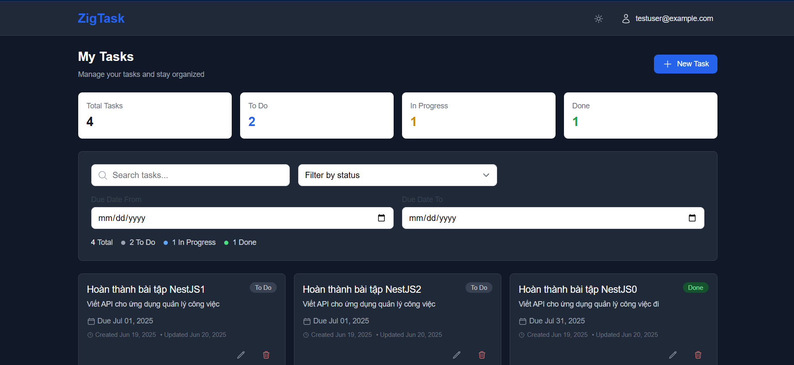
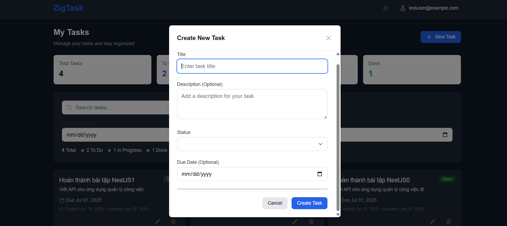
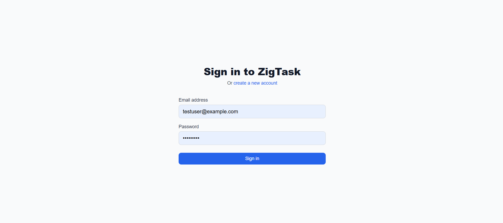

# ZigTask – Task Management App

## 📖 Project Overview
ZigTask allows users to:
- Sign up, sign in, sign out
- Create, edit, delete tasks (title, description, due date, status)
- View tasks grouped by status ("To Do", "In Progress", "Done")
- Drag & drop tasks between statuses (Kanban style)
- Search and filter tasks by title and date
- See real-time updates across clients (WebSocket)
- Enjoy dark mode and responsive UI

## 📦 Folder Structure
- `zigtask-api/` — NestJS backend (API, DB, Auth, WebSocket)
- `zigtask-client/` — React frontend (UI, state, API, WebSocket)
- `.github/` — CI/CD workflows

## 🚀 Setup & Run Instructions

### 1. Backend (`zigtask-api`)
```bash
cd zigtask-api
cp .env.example .env # chỉnh sửa biến môi trường nếu cần
npm install
npm run typeorm migration:run # nếu dùng PostgreSQL
npm run start:dev
```
- Truy cập Swagger API docs tại: [http://localhost:3001/docs](http://localhost:3001/docs)

### 2. Frontend (`zigtask-client`)
```bash
cd zigtask-client
npm install
npm start
```
- Ứng dụng chạy tại: [http://localhost:3000](http://localhost:3000)

### 3. CI/CD
- Đã cấu hình CI cho cả API và client tại `.github/workflows/`
- Chạy lint, test, build tự động trên mỗi pull request

## ⚙️ Technical Decisions & Trade-offs
- **Backend:** NestJS + TypeORM (PostgreSQL), JWT Auth, class-validator, Swagger, WebSocket Gateway
- **Frontend:** React + TypeScript, Zustand cho state, Tailwind CSS cho UI, @hello-pangea/dnd cho drag/drop, toast notification, dark mode toggle
- **Real-time:** WebSocket (Socket.io) cho cập nhật trạng thái task tức thì
- **CI/CD:** Github Actions, kiểm tra lint, test, build
- **Ưu tiên UX:** Modal, toast, loading/error state, responsive, dark mode

## 📚 API Documentation
- Swagger: [http://localhost:3001/docs](http://localhost:3001/docs)
- Một số endpoint chính:
  - `POST /auth/signup` — Đăng ký
  - `POST /auth/login` — Đăng nhập (JWT)
  - `GET /tasks` — Lấy danh sách task (filter, search, group)
  - `POST /tasks` — Tạo task
  - `PUT /tasks/:id` — Sửa task
  - `DELETE /tasks/:id` — Xóa task
  - WebSocket events: `taskStatusUpdated`, `taskCreated`, ...

## 🖼️ Screenshots




## 🧪 Testing
Hiện tại dự án **chưa có test tự động** cho cả backend và frontend.
- Nếu muốn bổ sung test, có thể tạo các file test theo hướng dẫn của NestJS (backend) hoặc React Testing Library (frontend).
- Các lệnh test mặc định:
  - Backend: `npm run test`, `npm run test:e2e`, `npm run test:cov`
  - Frontend: `npm test`

## 🌑 Dark Mode
- Toggle dark/light theme ngay trên giao diện Web
- Giao diện tự động lưu lựa chọn theme của user

## 🏗️ Submission Notes
- Đã commit theo từng bước, rõ ràng
- Đã triển khai CI/CD, test, lint
- README này trình bày đầy đủ các yêu cầu: overview, setup, quyết định kỹ thuật, tài liệu API, screenshot, test, CI/CD, dark mode

## 📫 Liên hệ
- Tác giả: Nguyễn Duy Phuong
- Email: phuongnd0239@gmail.com

> **ZigTask** — A full-stack, real-time, modern task management app for the Zigvy interview assignment.