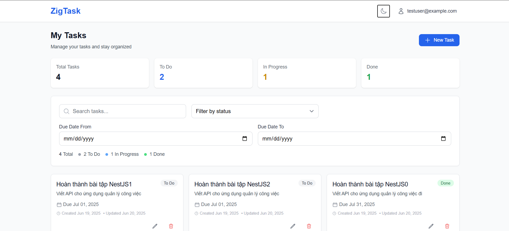

# ZigTask – Task Management App

## 📝 Project Overview
ZigTask là ứng dụng quản lý công việc gồm backend NestJS (PostgreSQL), frontend React + TypeScript, hỗ trợ đăng ký/đăng nhập, tạo/sửa/xóa task, lọc, tìm kiếm, dark mode.

## 🚀 Quick Start

### 1. Backend (NestJS)
```bash
cd zigtask-api
npm install
npm run start:dev
# Mặc định chạy ở http://localhost:3000
Swagger API docs: http://localhost:3000/api/docs
2. Frontend (React)
cd zigtask-client
npm install
npm start
# Mặc định chạy ở http://localhost:3001
🎯 Chức năng chính
Đăng ký, đăng nhập, đăng xuất, refresh token
CRUD task: tiêu đề, mô tả, hạn, trạng thái (“To Do”, “In Progress”, “Done”)
Lọc, tìm kiếm, filter theo ngày/tiêu đề
Giao diện responsive, dark mode
State: Zustand (frontend)
API: JWT, validation, Swagger docs
💡 Decisions & Trade-offs
State: Chọn Zustand vì nhẹ, code ngắn gọn.
UI: TailwindCSS giúp dựng giao diện nhanh, dễ custom.
API: JWT bảo mật, dễ tích hợp.
Chưa có: Drag-and-drop, test tự động, CI/CD (ưu tiên chức năng cốt lõi).
📸 Screenshots




📝 Notes
Để chạy local cần NodeJS 16+, PostgreSQL.
Nếu có lỗi port, kiểm tra port 3000 (backend) và 3001 (frontend) có bị chiếm không.